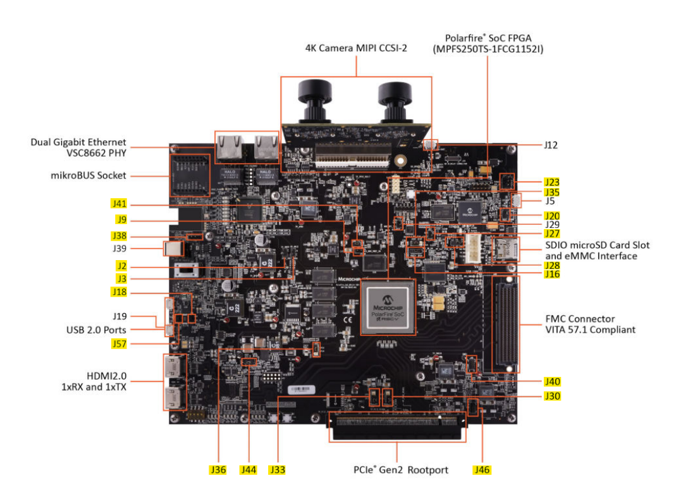

# PolarFire&reg; SoC Video Kit VectorBlox Demo QuickStart Guide

This document provides a guide for quickly setting up and running a VectorBlox demo using the PolarFire SoC Video Kit. Complete the prerequisites, then follow the board setup steps. Finally, refer to the “Controlling the VectorBlox Demo” section for instructions on operating the board.

## Table of Contents

- [QuickStart Prerequisites](#quickstart-prerequisites)
- [Board Setup](#board-setup)
  - [Step 1: Jumper Settings](#step-1-jumper-settings)
  - [Step 2: Hardware Connections](#step-2-hardware-connections)
  - [Step 3: Programming the Job File](#step-3-programming-the-job-file)
  - [Step 4: Programming the Linux Image](#step-4-programming-the-linux-image)
  - [Step 5: Setting up the VectorBlox Demo](#step-5-setting-up-the-vectorblox-demo)
- [Controlling the VectorBlox Demo](#controlling-the-vectorblox-demo)
- [Next Steps](#next-steps)

## QuickStart Prerequisites

- [FlashPro Express](https://www.microchip.com/en-us/products/fpgas-and-plds/fpga-and-soc-design-tools/programming-and-debug#Download%20Software) is required to program an FPGA bitstream to a target development kit. FlashPro Express can be installed as a standalone tool with the Program and Debug tools and is also installed with Libero SoC.
- [USBImager](https://bztsrc.gitlab.io/usbimager/) is required to program a Linux image to a target memory using the Hart Software Services.
- [Setup Serial Terminal](https://onlinedocs.microchip.com/oxy/GUID-E89F0380-CE10-4E39-B622-CA56F677F477-en-US-3/GUID-252CFF5A-1DB8-421F-B210-A5C575B68FE7.html) is required for UART communication with the board
- Ethernet connectivity to the internet via connection to IP Gateway

## Board Setup

### Step 1: Jumper Settings

**The PolarFire SoC Video Kit comes with the jumpers set up correctly out of the box.** If you change the jumpers or encounter issues, refer to the jumper table below or the [VectorBlox PolarFire SoC Video Kit Demo Guide PDF](VectorBlox_PolarFire_SoC_Video_Kit_Demo_Guide.pdf).

**Note:** Jumpers J16 and J35 must be closed, connected to pins 2 and 3.



#### Jumper Configuration Table for VectorBlox Demo

| Jumper      | Default Position | Functionality                                                                                                  |
| :---------- | :--------------- | :---------------------------------------------------------------------------------------------------------     |
| J2          |  Open            |  DDR controller reference voltage  <br> Open: no external reference <br> Closed: External reference provided|
| J3          |  Open            |  DDR controller reference voltage  <br> Open: no external reference <br> Closed: External reference provided|
| J9          |  Open            |  MSS DDR Vref  <br> Open: no external reference  <br> Closed: External reference provided                   |
| J16         |  Closed 2 and 3  |  VCC for eMMC/SD                                                                                              |
| J18         |  Open            |  USB device mode selection  <br> Open: USB client  <br> Closed: USB host                                      |
| J20         |  Closed 1 and 2  |  Required for Embedded FlashPro6 (eFP6). VBUS source. Leave closed.                                            |
| J23         |  Closed 1 and 2  |  Backlight LED driver VANODE  <br> FlashPro Jumpers  <br> Jumper Description                                  |
| J27         |  Open            |  JTAG nTRST interface pull down enable. Leave it open. <br> J20 VBUS source. Leave it closed.                  |
| J28         |  Closed 1 and 2  |  Used to select between Embedded FlashPro6 and external FlashPro header <br> Closed: eFP6 connected to J5 micro-USB port <br> Open: External FlashPro connected to J31 header  |
| J30         |  Closed 1 and 2  |   VDDAUX1 voltage                                                                                             |
| J33         |  Closed 1 and 2  |   VDDAUX9 voltage                                                                                             |
| J35         |  Closed 2 and 3  |   VCC for eMMC/SD                                                                                             |
| J36         |  Closed 1 and 2  |   VDDAUX4 voltage                                                                                             |
| J38         |  Open            |   WiFi chip I2C CLK and data                                                                                  |
| J40         |  Closed 9 and 10 |   Bank9 voltage 3v3                                                                                           |
| J41         |  Closed 1 and 2  |   125 MHz output                                                                                              |
| J44         |  Closed 1 and 2  |   Core voltage (VDD) set to 1.05V                                                                           |
| J46         |  Closed 9 and 10 |   Bank1 voltage 3v3 for CAN testing                                                                           |
| J57         |  Open            |   USB device mode selection  <br> Open: USB client  <br> Closed: USB host                                     |

### Step 2: Hardware Connections

The highlighted areas in the image indicate the required hardware connections.

**Note:** J39, J12, J5, and J15 are **not** jumpers; they are wire connections to the board.


#### Hardware Connections Table for VectorBlox Demo

| Port                  | Type          | Description                                                                                                |
| :-------------------- | :------------ | :--------------------------------------------------------------------------------------------------------- |
| 4K Camera MIPI        | Camera        | Dual camera sensor module                                                                                  |
| J13 HDMI 1xRX         | HDMI          | Connect this HDMI to the host PC for input video                                                           |
| J14 HDMI 1xTx         | HDMI          | Connect this HDMI to the output monitor for output video display                                           |
| Dual Gigabit Ethernet | Ethernet      | Used for SSH commands and downloading sample models and SDK; either ethernet port will suffice             |
| J39                   | Power Adapter | 12V, 5A power cord                                                                                         |
| J12                   | Micro USB     | UART port, interacts with the FPGA via the Hart Software Service/HSS (UART0) and the Linux terminal (UART1) |
| J5                    | Micro USB     | FlashPro6 port, used to program the job file                                                               |
| J19                   | Micro USB     | USB OTG port, used to transfer the Yocto image with USBImager after flashing .job file                      |

### Step 3: Programming the Job File

Programming the [job](https://github.com/Microchip-Vectorblox/VectorBlox-SoC-Video-Kit-Demo/releases) file will program the FPGA fabric with the latest reference configuration and program the eNVM with the latest HSS payload. The .zip file in the release assets should be downloaded and extracted to access the programming job file.

- **Click [this link](https://github.com/Microchip-Vectorblox/VectorBlox-SoC-Video-Kit-Demo/releases/download/release-v3.1/Vectorblox-SoC-Video-Kit-Demo.job.v3.1.zip) to download the no compression V1000 job file for VectorBlox 3.1**
- Ensure that J5 and J12 USB cables are connected to the board.
- Follow the steps to set up the serial terminal so the computer can communicate with the FPGA's UART.
- Load the `.job` file in FlashPro Express as a New Project under the Project tab in the menu and then select `Run`.
- Power-cycle the board once the process is complete.

**Note:** For VectorBlox 3.0 or higher, there are four different job files: no compression (NCOMP), compression (COMP), HDMI input unstructured compression (UCOMP_HDMI), and MIPI input unstructured compression (UCOMP_MIPI). For the demo, please use the no compression job file in the link above when getting started.

### Step 4: Programming the Linux Image

The VectorBlox SoC Video Kit Demo is designed to operate on the 2023.02.1 Yocto release, which should be pre-installed.

#### Steps for Updating Yocto Linux

1. Download the required Linux image file:
   - [Download core-image-minimal-dev-mpfs-video-kit-20230328105837.rootfs.wic.gz](https://github.com/polarfire-soc/meta-polarfire-soc-yocto-bsp/releases/download/v2023.02.1/core-image-minimal-dev-mpfs-video-kit-20230328105837.rootfs.wic.gz)
   - Extract the downloaded `.gz` file

2. Flash the image:
   - Follow the **eMMC Content Update Procedure section in [flashing_yocto_linux.md](./flashing_yocto_linux.md)**

3. Verify the installation:
   - Log in as `root` on UART1 (no password required)  
   - Run the command: `uname -r`  
   - This will display the current Yocto version to confirm successful installation  

### Step 5: Setting Up the VectorBlox Demo  

1. Initial Setup
   - Connect a Cat-5 cable between either RJ-45 on the board and a Wi-Fi extender to IP Router/Gateway or directly to IP Router/Gateway.
   - Log in as `root` user via one of the following methods:  
     - MMUART1 serial connection
     - SSH over Ethernet (get IP address by running `ifconfig` or `ip a | grep dynamic`)
   - Ensure HDMI cables are connected to the PolarFire SoC Video Kit (Rx/Tx ports)
   - Connect the camera daughter card to the PolarFire SoC Video Kit board

2. Download the [quick_start_3.sh](https://raw.githubusercontent.com/Microchip-Vectorblox/assets/refs/heads/main/quick_start_3.sh) script to the root directory and run it:

    ```bash
    wget --no-check-certificate https://raw.githubusercontent.com/Microchip-Vectorblox/assets/refs/heads/main/quick_start_3.sh 
    ```

3. The `quick_start_3.sh` script accepts a version parameter (defaults to `3.1`). This feature requires VectorBlox 3.0 or higher; for older versions, refer to the corresponding release tag.

    For a default NCOMP (no compression) .job file:

    ```bash
    bash quick_start_3.sh
    ```

   For a COMP (compression) .job file:

    ```bash
    bash quick_start_3.sh 3.1 COMP
    ```

   For a UCOMP (unstructured compression) .job file:

    ```bash
    bash quick_start_3.sh 3.1 UCOMP
    ```

#### Important Notes

- Please ensure that the compression parameter passed to the quickstart script aligns with the compression type used in the job file.
- This feature requires VectorBlox 3.0 or higher. For older versions, refer to the corresponding tag.
- **When switching between different .job files:** Delete any existing `VectorBlox-SDK-release` folders before re-running the setup script.
- After the script completes, wait approximately 30 seconds, then power-cycle the board to ensure the file transfer completes properly.
- The `v4l2-start_service.sh` service runs automatically at Linux boot and manages video input selection. HDMI input takes priority over camera input when both are connected.

## Controlling the VectorBlox Demo

A list of models that the demo runs can be found in the [demo_models.h](https://github.com/Microchip-Vectorblox/VectorBlox-SDK/blob/master/example/soc-video-c/demo_models.h) file. The demo models header file is located in the `examples/soc-video-c` directory of the VectorBlox SDK and is transferred to the board when running the quickstart shell script.

Refer to [adding_models.md](./adding_models.md) for instructions on adding models generated from the SDK.

To interact with the demo:

- Use the `ENTER` key to switch models. Entering `q` (pressing `q` and `ENTER`) quits the demo.
- In the `Recognition` mode, you can enter `a` to add or `d` to delete face embeddings.
  - Entering `a` initially highlights the largest face on-screen, and entering `a` again adds that face to the embeddings. You will then be prompted to enter a name (or just press `ENTER` to use the default ID).

  - Entering `d` will list the indices and names of the embeddings. Enter the desired index to delete the specified embedding from the database (or press `ENTER` to skip the deletion).

- Entering `b` on any models that use Pose Estimation for postprocessing will allow the user to toggle between blackout options for the image output.

Sample videos for input to the Face Recognition mode are available [here](https://github.com/Microchip-Vectorblox/assets/releases/download/assets/SampleFaces.mp4).

## Next Steps

Once the demo is up and running, feel free to look at the [Adding Models markdown file](./adding_models.md) for instructions on adding binary model files generated by the [VectorBlox SDK](https://github.com/Microchip-Vectorblox/VectorBlox-SDK/blob/master/).
